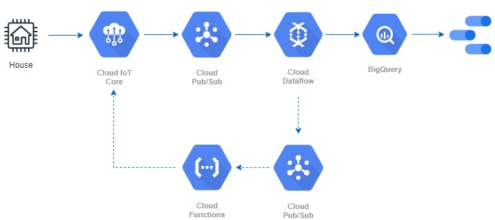
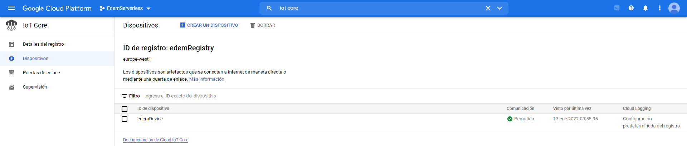
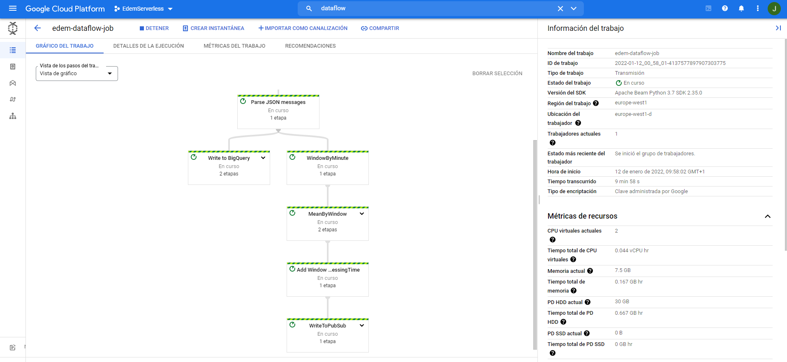

# IoT Serverless real-time architecture
Serverless Data Processing | EDEM 2022

#### Case description
Wake is a startup focused on sustainable architecture. One of its many challenges is reducing electricity consumption in buildings. To achieve this challenge, the have launched a RFP to monitor the temperature and humidity in order to regulate the optimal temperature of our homes.

#### Business challenges

- Part 01: Monitoring the registered temperature and humidity and display them on a dashboard to help stakeholders to make decisions.
- Part 02: Regulate climate control when an inappropiate temperature range is registered during a certain period.

#### Data Architecture


# Part 01: Serverless data processing with Dataflow

## Setup Requirements
- [Google Cloud Platform - Free trial](https://console.cloud.google.com/freetrial)
- Clone this **repo**
- For this Demo, we will be working on a **Cloud Shell**.
- Enable required *Google Cloud APIs* by running the following commands:

```
gcloud services enable dataflow.googleapis.com
gcloud services enable cloudiot.googleapis.com
gcloud services enable cloudbuild.googleapis.com
```
- Create Python environment
```
virtualenv -p python3 <ENVIRONTMENT_NAME>
source <ENVIRONMENT_NAME>/bin/activate
```
- Install python dependencies by running the followinw command:

```
pip install -U -r setup_dependencies.txt
```

## PubSub
First of all, we will create two **Topics** and their default **Subscriptions**.

- Go to Cloud Console [PubSub](https://console.cloud.google.com/cloudpubsub) page. 
- Click **Create Topic**, provide a unique topic name and check **add default subscription** option. 

Both Topics and subscriptions are needed in the following steps in order to create the Data pipeline.

## Cloud Storage

Go to Cloud Console [Cloud Storage](https://console.cloud.google.com/storage) page.

- Create a **bucket** specifying a global unique name. This bucket will be used to store Dataflow Flex template.

## IoT Core

For this demo, we will use Cloud Shell as an IoT data simulator.

- Go to Cloud Console [IoT Core](https://console.cloud.google.com/iot) page.
- Create an IoT Registry by choosing one of the PubSub Topics created before.
- Go to Cloud Shell and generate a **RSA key with self-signed X509 certificate**. more [info](https://cloud.google.com/iot/docs/how-tos/credentials/keys#generating_an_rsa_key)
- Once you have both registry and RSA key created, register a device and upload *rsa_cert.pem* file in *authentication* section.

Now, we have linked our device (Cloud Shell) with IoT Core.



## BigQuery

- Go to Cloud Console [BigQuery](https://console.cloud.google.com/bigquery) page.
- Create a **BigQuery Dataset** by specifying EU as data location.
- Nothing else will be required as BigQuery table will be created by Dataflow Pipeline.

## Dataflow

- Go to [Dataflow folder](https://github.com/jabrio/Serverless_EDEM/tree/main/02_Dataflow) and follow the instructions placed in **edemDataflow.py** file in order to processing the data by Beam pipeline.
- In this demo, we will create a **Dataflow Flex Template**. More [info](https://cloud.google.com/dataflow/docs/guides/templates/using-flex-templates).
- You have the files needed in Dataflow folder (*Dockerfile* and *requirements.txt*).
- [Package your python code into a Docker image](https://cloud.google.com/dataflow/docs/guides/templates/using-flex-templates#python_only_creating_and_building_a_container_image) and store it in Container Registry. You can do this by running the following command:

```
gcloud builds submit --tag 'gcr.io/<YOUR_PROJECT_ID>/<YOUR_FOLDER_NAME>/<YOUR_IMAGE_NAME>:latest' .
```
- [Create Dataflow Flex Template](https://cloud.google.com/dataflow/docs/guides/templates/using-flex-templates#creating_a_flex_template) from Docker image:

```
gcloud dataflow flex-template build "gs://<YOUR_BUCKET_NAME>/<YOUR_TEMPLATE_NAME>.json" \
  --image "gcr.io/<YOUR_PROJECT_ID>/<YOUR_FOLDER_NAME>/<YOUR_IMAGE_NAME>:latest" \
  --sdk-language "PYTHON" 
```

- Finally, run a [Dataflow job from template](https://cloud.google.com/dataflow/docs/guides/templates/using-flex-templates#running_a_flex_template_pipeline):

```
gcloud dataflow flex-template run "<YOUR_DATAFLOW_JOB_NAME>" \
    --template-file-gcs-location "gs://<YOUR_BUCKET_NAME>/<YOUR_TEMPLATE_NAME>.json" \
    --region "europe-west1"
```



## Send data from device

- Go to [IoTCore folder](https://github.com/jabrio/Serverless_EDEM/tree/main/01_IoTCore) and run the following command in order to start generating data.

```
python edemDeviceData.py \
    --algorithm RS256 \
    --cloud_region europe-west1 \
    --device_id <YOUR_IOT_DEVICE_NAME> \
    --private_key_file rsa_private.pem \
    --project_id <YOUR_PROJECT_ID> \
    --registry_id <YOUR_IOT_REGISTRY>
```

## Verify data is arriving and visualize them with Data Studio

- Go to [BigQueryUI](https://console.cloud.google.com/bigquery) and you should see your bigquery table already created.


- Go to [**Data Studio**](https://datastudio.google.com/). Link your BigQuery table.
- Create a Dashboard as shown below, which represents temperature and humidity of the device.


# Part 02: Event-driven architecture with Cloud Functions

- Go to [CloudFunctions folder]() and follow the instructions placed in edemCloudFunctions.py file.
- Go to Cloud Console [Cloud Functions](https://console.cloud.google.com/functions) page.
- Click **Create Function** (europe-west1) and choose **PubSub** as trigger type and click **save**.
- Click **Next** and choose **Python 3.9** as runtime.
- Copy your code into Main.py file and python dependencies into requirements.txt.
- when finished, Click **deploy**.
- If an aggregate temperature by minute is out-of-range, **a command will be thrown to the device and its config will be updated**. You can check that by going to *config and state* tab in IoT device page.
- Useful information: [IoT Core code samples](https://cloud.google.com/iot/docs/samples)

# Solution
- [IoT Real-time Serverless architecture Part 01](https://www.youtube.com/watch?v=gXngs3pTYJ8)
- [IoT Real-time Serverless architecture Part 02](https://www.youtube.com/watch?v=mh8kNW1OOAU)
